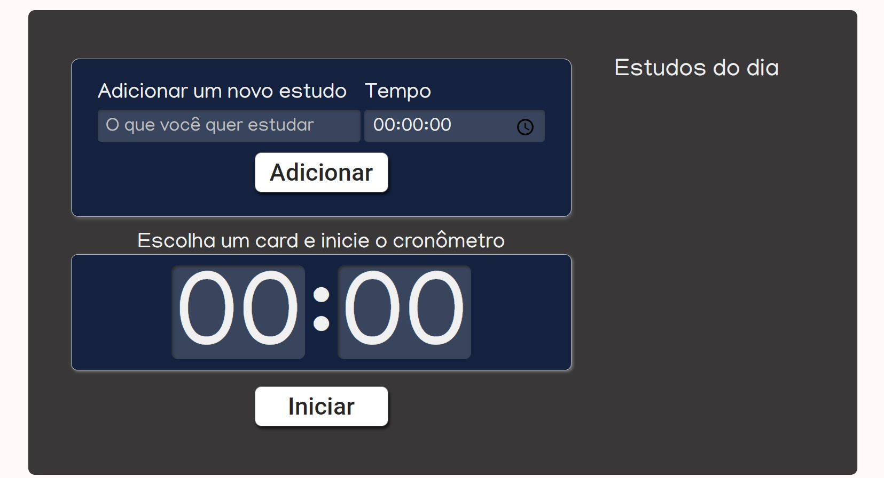
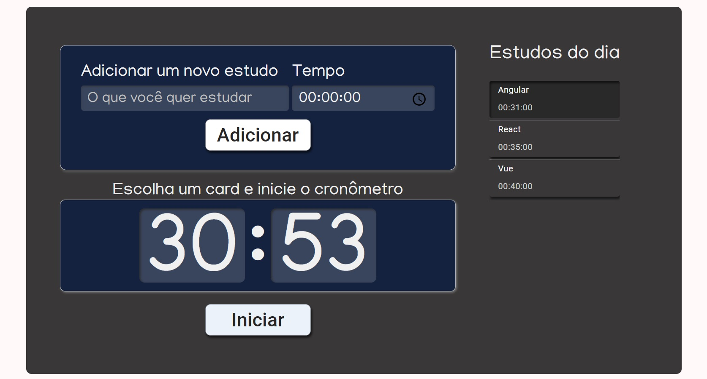
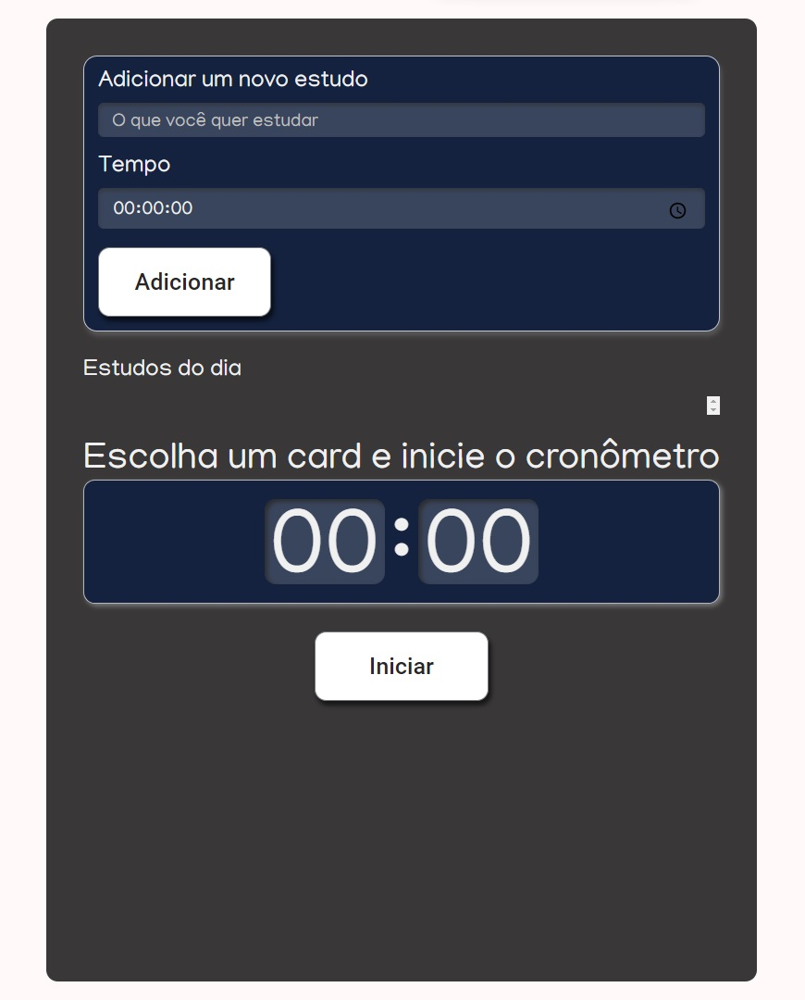
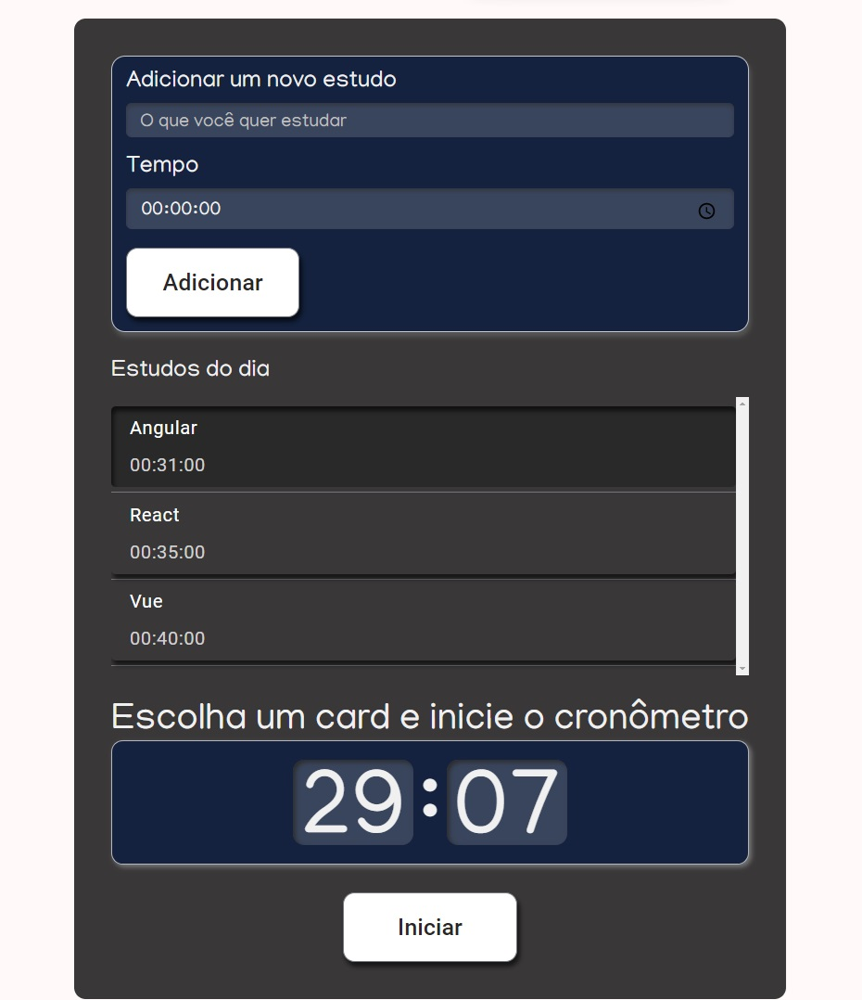

## Angular - WebApp Responsivo - Lista de Tarefas com cronômetro regressivo

Este projeto tem como objetivo criar uma aplicação Angular, focada na criação de componentes reutilizáveis, escaláveis e dinâmicos.

A aplicação permite que o usuário insira o nome de uma tarefa e o tempo desejado para sua realização através de um formulário. O usuário pode adicionar uma ou várias tarefas, gerando uma lista. Em seguida, é possível selecionar uma tarefa e iniciar um temporizador regressivo. Quando o tempo se esgota, a tarefa é marcada como concluída com um check.

  
Tela Cheia

 

 

 

  
Telas Responsivas

  

   
   
 

